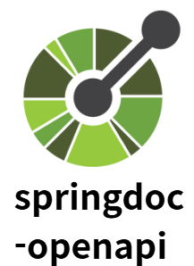
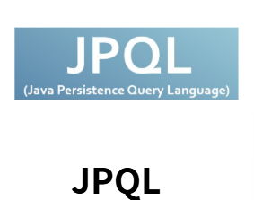
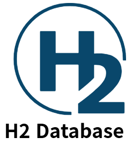
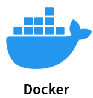
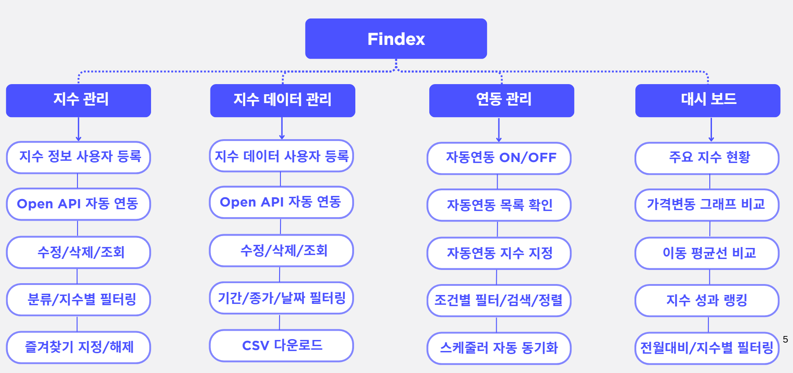
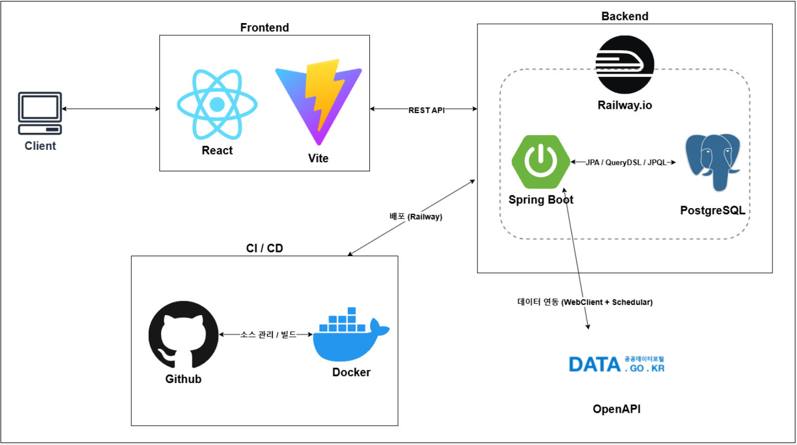
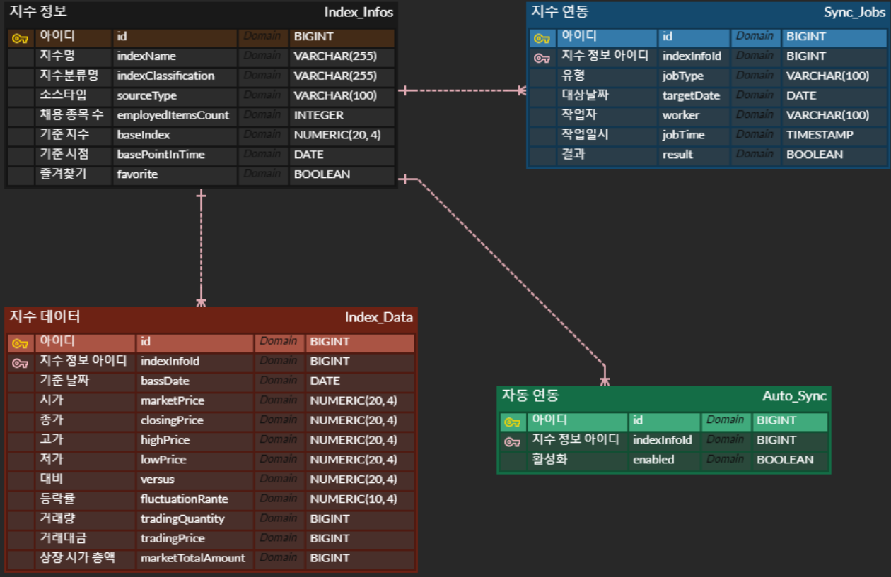

# 📊 Findex

- **프로젝트 기간**: 2025.09.05 ~ 2025.09.16
- **API 명세서**: [Swagger UI](http://sprint-project-1196140422.ap-northeast-2.elb.amazonaws.com/sb/findex/api/swagger-ui/index.html)
- **협업 문서**: [Notion](https://www.notion.so/5-1-Findex-2657bb3b3a0f80668d08e6e1dac8a874)
- **GitHub**: [codeit-projects-5th/Findex](https://github.com/codeit-projects-5th/Findex)
- **배포 링크**: [https://findex-production.up.railway.app/#/dashboard](https://findex-production.up.railway.app/#/dashboard)

 

## 📖 프로젝트 소개

> 📊 다양한 금융 지수를 한눈에 확인하고, 손쉽게 활용할 수 있는 **금융 대시보드 서비스**  
> **Findex**는 공공데이터포털 금융위원회 시세정보 OpenAPI를 연동하여  
> 지수 데이터를 자동으로 수집·저장하고, 분석 및 시각화를 통해 직관적으로 탐색할 수 있도록 지원

- 지수 등록/조회/삭제/수정 기능 제공
- 지수 데이터 등록/조회/삭제 수정 기능 제공
- 자동 연동 ON/OFF, 즐겨찾기, CSV 다운로드 등 편의 기능 지원
- 대시보드 기반의 지수 현황, 이동평균선 비교, 성과 랭킹 제공

 

## 🛠 기술 스택

### 🎨 Frontend
  

---

### ⚙️ Backend

---

### 🛢 Database

---

### 🚀 CI/CD

---

### 🤝 협업 도구

 
 
 
 
 

## 📌 주요 기능

 
 
 

## 📌시스템 아키텍처

  

 
 

## 📌 ERD 다이어그램

  

 
